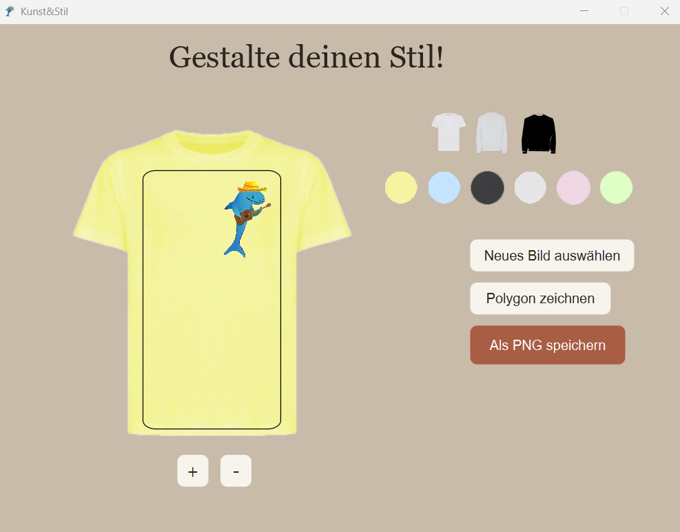
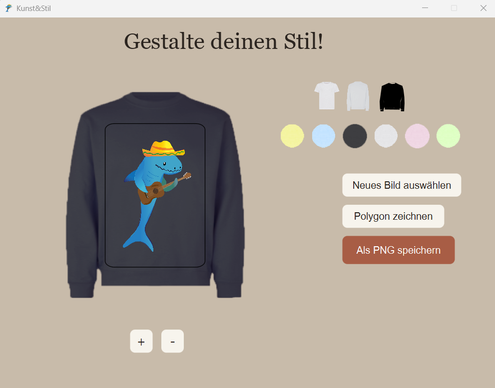
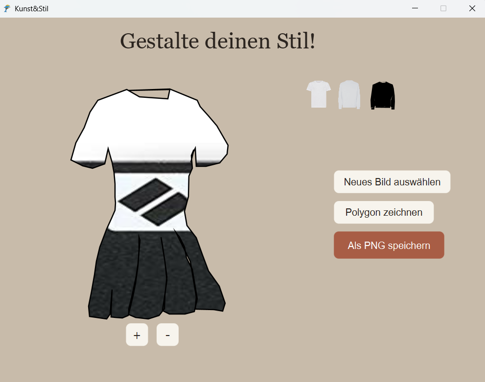

# Clothing Preview Generator

Eine kleine JavaFX-Anwendung zum Experimentieren mit Stoffmustern und der Darstellung von Kleidungsstücken.

Die Idee des Projekts ist es, ein Foto eines Stoffes hochzuladen und diesen Stoff auf verschiedenen Kleidungsstücken zu visualisieren. Das Projekt begann als Experiment im Bereich Modedesign und wurde Schritt für Schritt zu einer interaktiven JavaFX-Anwendung weiterentwickelt.

## Über das Projekt

Die Anwendung ermöglicht es, ein Kleidungsstück auszuwählen, dessen Farbe zu ändern, ein Stoffbild hochzuladen und dieses direkt auf dem Kleidungsstück zu positionieren und zu skalieren.

Zusätzlich gibt es eine experimentelle Polygon-Funktion. Damit kann eine beliebige Form definiert und mit einem Stoffbild gefüllt werden. Diese Funktion entstand als erster Schritt in Richtung komplexerer Kleidungsformen, zum Beispiel Kleider, die aus mehreren verschiedenen Stoffen bestehen können.

## Funktionen

- Auswahl eines T-Shirts oder Pullovers
- Änderung der Produktfarbe
- Hochladen eines Stoffbildes
- Verschieben des hochgeladenen Bildes
- Vergrößern und Verkleinern des Bildes
- Begrenzung des Bildes auf einen definierten Produktbereich
- Erstellen einer beliebigen Polygonform
- Anwenden eines Stoffbildes auf ein Polygon
- Verschieben und Zoomen des Stoffmusters innerhalb des Polygons
- Speichern des erstellten Designs

## Funktionsweise

### 1. Produkt auswählen

Der Benutzer kann zwischen verschiedenen Kleidungsstücken wie T-Shirt und Pullover wählen.

### 2. Farbe auswählen

Für die vordefinierten Kleidungsstücke kann eine Farbe aus der Farbpalette ausgewählt werden.

### 3. Stoffbild hochladen

Der Benutzer kann ein Foto eines echten Stoffes hochladen.

Das Bild kann anschließend auf dem ausgewählten Kleidungsstück positioniert und skaliert werden.

### 4. Mit einem Polygon arbeiten

Mit der Polygon-Funktion kann eine beliebige Produktform definiert werden.

Auf diese Form kann ein Stoffbild angewendet werden. Das Stoffmuster kann anschließend innerhalb der Form verschoben und gezoomt werden.

Dieser Teil des Projekts ist experimentell und dient als Grundlage für zukünftige Kleidungsformen und komplexere Designs.

## Verwendete Technologien

- Java
- JavaFX
- Objektorientierte Programmierung
- Vererbung
- JavaFX `ImageView`, `Group`, `Polygon`, `Rectangle` und `ImagePattern`
- Dateiverarbeitung
- Git / GitHub

## Objektorientierte Programmierung

Das Projekt verwendet Vererbung, um verschiedene Arten von Kleidungsstücken darzustellen.

Die Basisklasse `Produkt` stellt gemeinsame Funktionen bereit. Spezifische Produkte wie `TShirt` und `Pullover` erweitern diese Klasse.

Die Polygon-Funktionalität ist über die Klasse `PolygonDesProdukt` umgesetzt.

Die Struktur war gleichzeitig Teil meines Lernprozesses und hat mir ermöglicht, Vererbung und den Umgang mit unterschiedlichen Objekttypen praktisch anzuwenden.

## Meine Arbeit am Projekt

Ich habe das Projekt als eigenständiges Programmierprojekt entwickelt.

Zu meinen wichtigsten Aufgaben gehörten:

- Entwicklung der Idee und des grundlegenden Programmablaufs
- Umsetzung der JavaFX-Benutzeroberfläche
- Implementierung der Produktauswahl
- Implementierung der Farbauswahl
- Implementierung des Bilduploads
- Verschieben und Skalieren von Bildern
- Arbeiten mit definierten Produktbereichen und Clipping
- Entwicklung und Erprobung der Polygon-Funktion
- Verschieben und Zoomen von Stoffmustern innerhalb von Polygonen
- Implementierung der Speicherung der erstellten Designs
- Aufteilung der Anwendung in verschiedene Klassen und Pakete

Die Polygon-Funktion wurde als experimenteller Teil des Projekts entwickelt, um zu untersuchen, wie frei definierbare Kleidungsformen verarbeitet werden können.

## Projektstruktur

```text
src/
└── de/
    └── kunstundstil/
        ├── produkte/
        │   ├── Produkt
        │   ├── TShirt
        │   ├── Pullover
        │   ├── ProductGenerator
        │   └── BildAufDemProdukt
        │
        ├── polygons/
        │   └── PolygonDesProdukt
        │
        ├── fenster/
        │   ├── Header
        │   └── buttons/
        │       ├── ButtonFarbe
        │       ├── ButtonAuswaehlDesProdukts
        │       ├── ButtonPolygon
        │       └── ...
        │
        ├── pojo/
        │   └── RechteckAufDemProdukt
        │
        ├── print/
        │   └── BildSpeicherung
        │
        └── BildanzeigeApp
```

## Screenshots

### Produktauswahl



### Stoffvorschau



### Polygon-Funktion



## Anwendung starten

### Voraussetzungen

- Java JDK 21 oder kompatible Version
- JavaFX 21

### Starten

Das Repository kann beispielsweise mit IntelliJ IDEA geöffnet werden.

Stelle sicher, dass JavaFX korrekt konfiguriert ist und der Ordner `resources` verfügbar ist.

Anschließend kann die Anwendung über die Klasse

```text
BildanzeigeApp
```

gestartet werden.

## Mögliche zukünftige Erweiterungen

- Weitere Kleidungsstücke
- Komplexere Kleidungsformen
- Kleider mit mehreren unterschiedlichen Stoffbereichen
- Erweiterte Bearbeitung von Polygonen
- Speichern mehrerer Polygon-Designs
- Verbesserte Speicherung von Projekten
- Weitere Möglichkeiten zur Bearbeitung von Stoffmustern

## Projektstatus

Dieses Projekt ist ein persönliches Lern- und Experimentierprojekt.

Das Hauptziel war es, praktische Erfahrungen mit JavaFX, objektorientierter Programmierung, Vererbung, Bildbearbeitung, Clipping und polygonbasierten grafischen Interaktionen zu sammeln und diese Kenntnisse in einer eigenen Anwendung umzusetzen.